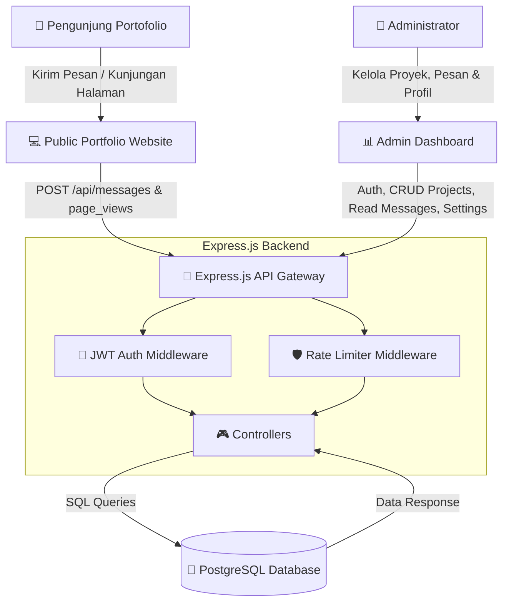

# 🌟 Master Plan: Premium Portfolio Dashboard

Dokumen ini berisi cetak biru (blueprint) dan rencana implementasi lengkap untuk membangun sistem **Portfolio Dashboard** yang modern, dinamis, dan terintegrasi penuh. Sistem ini akan mengubah portofolio statis Anda menjadi aplikasi web berbasis data yang dapat dikelola secara *real-time* melalui panel admin.

---

## 🗺️ Arsitektur Sistem & Aliran Data

Berikut adalah visualisasi aliran data antara pengunjung portofolio (Public View), panel admin (Dashboard View), server API (Express.js), dan basis data (PostgreSQL):



---

## 🗄️ Rancangan Database (Skema SQL Baru)

Untuk mendukung fitur-fitur premium, kita perlu menambahkan tiga tabel baru di dalam database PostgreSQL: `messages` (untuk kontak masuk), `page_views` (untuk analitik pengunjung), dan `settings` (untuk profil dinamis).

Jalankan perintah SQL berikut di terminal PostgreSQL (`psql`):

```sql
-- 1. TABEL PESAN MASUK (INBOX)
CREATE TABLE IF NOT EXISTS messages (
    id SERIAL PRIMARY KEY,
    name VARCHAR(150) NOT NULL,
    email VARCHAR(150) NOT NULL,
    subject VARCHAR(255) DEFAULT 'General Inquiry',
    message TEXT NOT NULL,
    is_read BOOLEAN DEFAULT FALSE,
    created_at TIMESTAMP DEFAULT CURRENT_TIMESTAMP
);

-- 2. TABEL PELACAKAN PENGUNJUNG (ANALYTICS)
CREATE TABLE IF NOT EXISTS page_views (
    id SERIAL PRIMARY KEY,
    ip_address VARCHAR(45) NOT NULL, -- Kompatibel dengan IPv6
    user_agent TEXT,
    visited_path VARCHAR(255) NOT NULL, -- Contoh: '/about', '/projects'
    visited_at TIMESTAMP DEFAULT CURRENT_TIMESTAMP
);

-- 3. TABEL CONFIG / SETTINGS (DITAMBAH KE DB)
CREATE TABLE IF NOT EXISTS settings (
    key VARCHAR(100) PRIMARY KEY,
    value TEXT NOT NULL,
    updated_at TIMESTAMP DEFAULT CURRENT_TIMESTAMP
);

-- Masukkan data default awal untuk profil Anda
INSERT INTO settings (key, value) VALUES
('site_name', 'Haidar DailyPorto'),
('email', 'admin@portfolio.com'),
('bio', 'I am an Information Technology student with a strong passion for software development.'),
('resume_url', 'https://drive.google.com/your-resume-pdf'),
('github_url', 'https://github.com/haidar'),
('linkedin_url', 'https://linkedin.com/in/haidar')
ON CONFLICT (key) DO NOTHING;
```

---

## ⚡ Fitur Utama Dashboard yang Akan Dibangun

Rencana ini dibagi menjadi **4 Fitur Utama** yang akan diintegrasikan secara *end-to-end* (Frontend & Backend):

### 📈 Fitur 1: Analitik Pengunjung Real-Time (Visitor Tracking)
Melacak performa website portofolio secara langsung tanpa bergantung pada Google Analytics.
*   **Backend:**
    *   Middleware pelacak otomatis (`analyticsMiddleware.js`) yang mencatat IP Address, User Agent, dan halaman yang diakses setiap kali ada request ke halaman publik.
    *   Endpoint `GET /api/analytics` (Protected) untuk menarik total pengunjung, grafik statistik harian, dan halaman yang paling sering diakses.
*   **Frontend (Dashboard Overview):**
    *   Mengintegrasikan **Recharts** untuk membuat **Growth Area Chart** (grafik tren kunjungan harian).
    *   Kartu statistik premium dengan mikro-animasi hover (efek glow + translate-y).
    *   Daftar *Top Visited Pages* dalam format tabel premium.

### 📥 Fitur 2: Sistem Inbox & Feedback Manager (Kontak Masuk)
Mengumpulkan pesan dari formulir kontak langsung ke panel admin.
*   **Backend:**
    *   Endpoint `POST /api/messages` (Public) dengan limitasi request ketat (Rate Limiting) untuk mencegah spamming.
    *   Endpoint `GET /api/messages` (Protected) dengan pagination.
    *   Endpoint `PATCH /api/messages/:id/read` (Protected) untuk menandai pesan sudah dibaca.
    *   Endpoint `DELETE /api/messages/:id` (Protected) untuk menghapus pesan.
*   **Frontend (Dashboard Inbox):**
    *   Menambahkan tab **Inbox** di Sidebar lengkap dengan badge **Notification Count** berwarna merah menyala (`bg-red-500`) yang menunjukkan jumlah pesan yang belum dibaca (`unread`).
    *   Panel pembaca pesan dua kolom (kiri: daftar pesan, kanan: detail isi pesan).

### ⚙️ Fitur 3: Integrasi Pengaturan Profil & Bio Dinamis
Mengubah profil, tautan CV, dan kontak sosial media Anda dari Dashboard, yang langsung tersinkronisasi di halaman utama portofolio.
*   **Backend:**
    *   Endpoint `GET /api/settings` (Public) untuk dikonsumsi halaman publik (`About`, `Contact`, `Home`).
    *   Endpoint `PUT /api/settings` (Protected) untuk menyimpan konfigurasi baru secara massal.
*   **Frontend (Dashboard Settings):**
    *   Formulir input modern lengkap dengan ikon visual untuk memperbarui informasi dasar, profil media sosial, dan deskripsi Bio.
    *   State tombol "Save Settings" dengan *loading spinner* dan integrasi Toast Notification (pesan sukses/gagal).

### 🔐 Fitur 4: Peningkatan Keamanan dengan JWT Authentication
Mengamankan Dashboard sehingga hanya Anda yang dapat mengelola portofolio.
*   **Backend:**
    *   Mengganti validasi login saat ini dengan **JSON Web Token (JWT)**.
    *   Menggunakan password enkripsi satu arah di database.
    *   Membuat middleware proteksi route `authenticateToken.js` untuk menjaga API sensitif dari akses tidak sah.
*   **Frontend:**
    *   Integrasi HTTP Interceptor (menggunakan Axios) untuk menyematkan JWT Token di header `Authorization: Bearer <token>` secara otomatis pada setiap request.
    *   *Protected Route* di React Router untuk mengalihkan pengunjung non-admin kembali ke halaman `/login` jika mencoba masuk ke halaman `/dashboard`.

---

## 📅 Rencana Tahapan Eksekusi (Roadmap)

Rencana ini dibagi menjadi **3 Phase** berurutan untuk menjamin kualitas kode:

| Phase | Fokus Utama | Target Deliverables | Est. Waktu |
| :--- | :--- | :--- | :--- |
| **Phase 1** | Pondasi Database & Auth JWT | Setup database baru (`messages`, `page_views`, `settings`) dan migrasi sistem login dengan keamanan JWT. | Hari 1-2 |
| **Phase 2** | Fitur Inbox & Pengaturan Profil | Pembangunan endpoint kontak masuk, halaman inbox admin, form pengaturan profil dinamis, dan sinkronisasi ke halaman publik. | Hari 3-4 |
| **Phase 3** | Analitik Pengunjung & Poles UI/UX | Implementasi middleware tracker kunjungan, integrasi Recharts untuk grafik overview dashboard, optimasi performa, dan micro-animations. | Hari 5 |

---

## 🎨 Token Desain & UX Estetika Premium
Agar dashboard Anda memberikan kesan mewah (*premium look*):
*   **Warna Latar:** Gunakan kombinasi warna gelap premium: `bg-zinc-950` untuk body, `bg-zinc-900/50` dengan backdrop blur `backdrop-blur-md` dan garis border tipis `border-zinc-800/80`.
*   **Aksen:** Efek gradasi berkilau pada tombol dan grafik (contoh gradasi: `from-blue-600 to-indigo-600` dengan shadow glow).
*   **Mikro-animasi:** Transisi hover pada sidebar dan kartu dengan `transition-all duration-300 ease-out hover:-translate-y-1 hover:shadow-lg hover:shadow-blue-500/5`.

---

> [!IMPORTANT]
> **Langkah Selanjutnya:** 
> Untuk memulai implementasi rencana ini, langkah pertama yang disarankan adalah **mengeksekusi migrasi database PostgreSQL** dengan membuat tabel-tabel baru di atas. Beritahu saya jika Anda siap menjalankan Phase 1!
